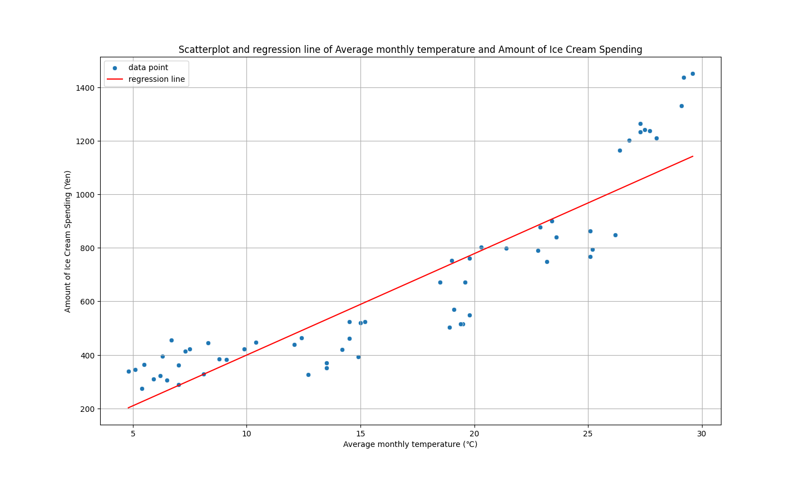

# アイスクリームの売り上げと気温の関係
# 1. 概要
分析の目的と散布図、回帰直線を用いた分析方法とその結果、考察を示す。

# 2. 分析計画
## 2-1. 目的
アイスクリームを販売する最適な時期を調べるために、アイスクリームの売り上げと気温の関係を分析する。これらの関係が分かれば、アイスクリームの売り上げを上げることができる。

## 2-2. 使用する分析方法
東京の月平均気温と1世帯当りアイスクリーム支出金額の関係を考察し、気温ごとの売り上げを予想するために、散布図を作成し、回帰直線を図示する。

## 2-3. 分析対象のデータ
東京の月平均気温と1世帯当りアイスクリーム支出金額の時系列データを使用する。

# 3. 分析結果
```import pandas as pd

# ファイルの読み込み
file_path = 'ta_ice.xlsx'
data = pd.read_excel(file_path)


import matplotlib.pyplot as plt
import seaborn as sns
from scipy.stats import pearsonr

import numpy as np
from sklearn.linear_model import LinearRegression

# 説明変数と目的変数
X = data['月平均気温'].values.reshape(-1, 1)
y = data['アイスクリーム支出金額'].values

# 回帰モデルの作成と学習
model = LinearRegression()
model.fit(X, y)

# 回帰係数と切片
slope = model.coef_[0]
intercept = model.intercept_

# 回帰直線の計算
x_range = np.linspace(X.min(), X.max(), 100)
y_range = slope * x_range + intercept

# 散布図と回帰直線のプロット
plt.figure(figsize=(10, 6))
sns.scatterplot(x=data['月平均気温'], y=data['アイスクリーム支出金額'], label='data point')
plt.plot(x_range, y_range, color='red', label='regression line')
plt.title('Scatterplot and regression line of Average monthly temperature and Amount of Ice Cream Spending')
plt.xlabel('Average monthly temperature (℃)')
plt.ylabel('Amount of Ice Cream Spending (Yen)')
plt.legend()
plt.grid(True)
plt.show()

# 回帰式
slope, intercept
```


上記より、回帰式は y=37.90x+20.33 となった。

# 4. 考察
分布図から東京の月平均気温と一世帯当たりのアイスクリーム支出金額には正の相関があることがわかった。また、回帰式から温度が1℃上がるとアイスクリーム支出金額が約37.9円上がることが分かった。気温が高いと汗をかき、暑さを感じるので普段よりもアイスクリームを食べたくなると考えられる。この結果から、アイスクリームの販売者は1年の中で気温が最も高い夏にアイスクリームを販売するのが最適だと考える。また、新商品などの新たな試みは夏に行った方が成功しやすいと考えられる。 また、夏にアイスクリームの消費が多くなることが考えられることから、消費者は夏には特に品切れに注意すべきであることが分かる。逆に温かい食べ物の支出金額と月平均気温の関係を調べることによってアイスクリームの支出が少ない冬などの戦略なども考えられるはずである。

# 5. 参考文献
- 千葉商科大学、「気温とアイスクリーム支出金額の回帰式」、千葉商科大学ウェブサイト、更新日不明、https://www3.cuc.ac.jp/~nagaoka/2016/ouyou/06/ta_ice/index.html　、(参照:2024/08/04)
- 気象庁、「過去の気象データ・ダウンロード」、気象庁ウェブサイト、更新日不明、https://www.data.jma.go.jp/gmd/risk/obsdl/index.php　、(参照:2024/08/04)
- 日本アイスクリーム協会、「家計調査実績」、日本アイスクリーム協会ウェブサイト、更新日不明、https://www.icecream.or.jp/iceworld/data/expenditures.html　、(参照:2024/08/04)
